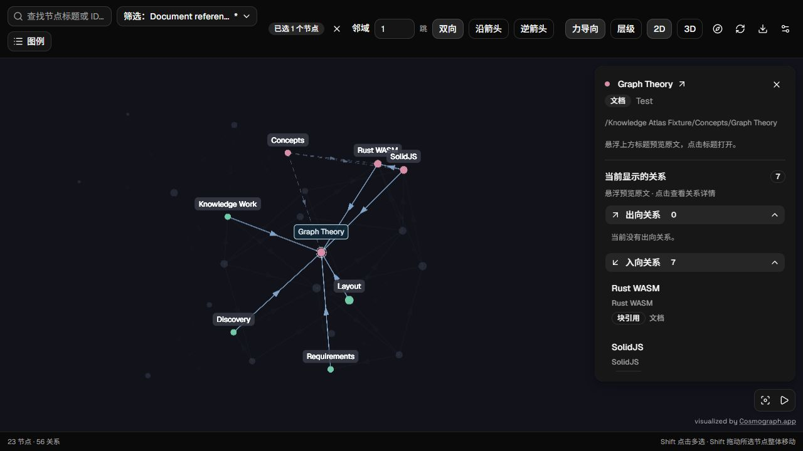
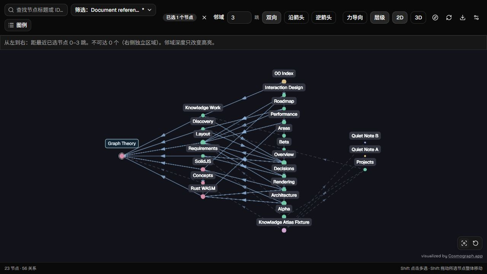
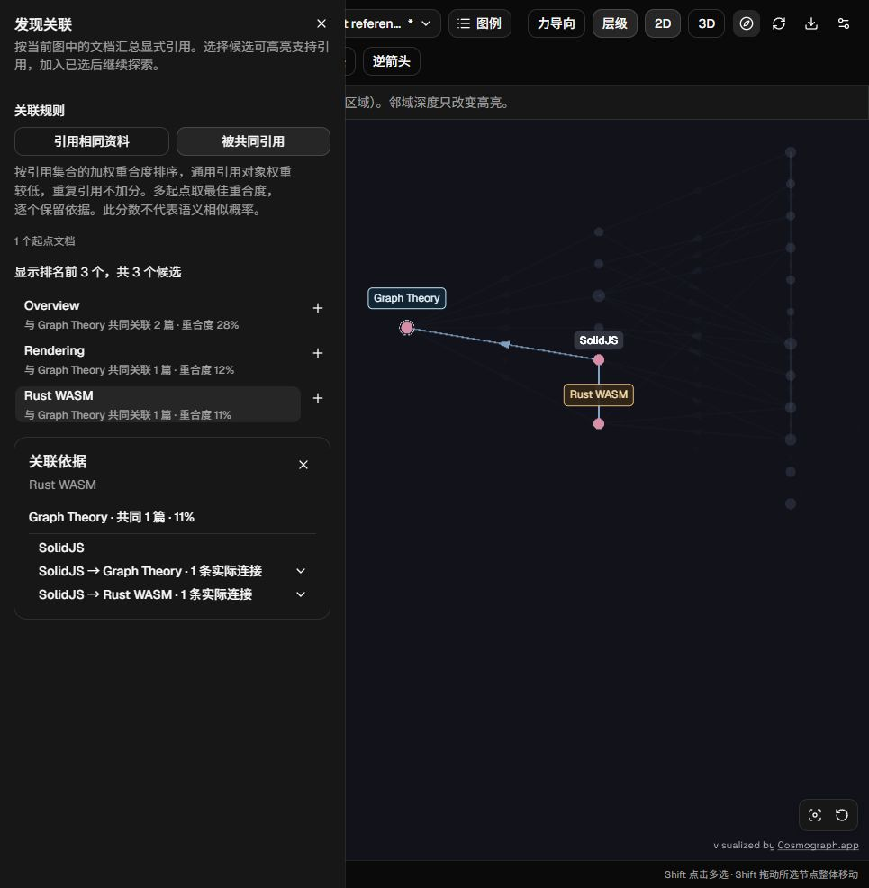

# 一个思源图谱

Explore SiYuan notes, blocks, and search results in an interactive 2D / 3D graph.

[简体中文](README_zh_CN.md) ·
[User guide](https://github.com/CherryGS/sy-another-graph/blob/master/docs/user-guide.md) ·
[Mouse & keyboard (简体中文)](https://github.com/CherryGS/sy-another-graph/blob/master/docs/mouse-keyboard_zh_CN.md)

_Screenshots below use demonstration notes from the test workspace._

## Explore notes and their connections

Explore in **2D or 3D**, Shift-click to select starting nodes, and follow directional neighborhoods or shortest paths.
Inspect references, containment, database relations, and optional text mentions, with native previews and source evidence.

_Select Graph Theory to highlight its neighbors and inspect the relationships on the right._

## Follow the graph in layers

Switch to **Layered** to arrange nodes from left to right by hop distance from the nearest selected node.
It follows the chosen traversal direction and works in 2D / 3D; neighborhood depth controls highlighting.

_Graph Theory is the starting node; the remaining documents occupy layers one to three._

## Discover related documents

**Discover relationships** finds documents that **cite the same material** or are **cited together**.
Browse ranked candidates and their supporting references, then use **+** to add a candidate to your selection.

_SolidJS cites both Graph Theory and Rust WASM, providing the evidence for this co-citation result._

## Filter your scope or start from search

Filter by notebook, document or block, node type, and excluded subtrees; keep frequently used configurations as **named presets**.
Turn all results from native search or [HZ Simple Search](https://github.com/Hug-Zephyr/HZ-syplugin-simple-search) into a graph, with ancestor context and rings identifying matches.

## Adjust the view and export

Color nodes by type, branch, notebook, or degree. Tune labels and community clustering, display 2D community territories, and export the visible graph as JSON.

## Get started

1. In desktop SiYuan **3.8.3+**, enable the plugin and click its toolbar icon or press **Alt+Shift+G**.
2. Start with the default document-reference graph, or use **View in graph** from a document or block context menu.
3. Open **Filter** to narrow the scope. Select starting nodes, then try **Layered** or **Discover relationships**.

The interface follows SiYuan's language, with Simplified Chinese and English support.
Graph acquisition reads the local index without editing notes. Large-graph responsiveness depends on the data, hardware, and layout settings.

See the [user guide](https://github.com/CherryGS/sy-another-graph/blob/master/docs/user-guide.md)
for search behavior, mention exclusions, source diagnostics, runtime requirements, and limits.

## License and attribution

Original project code is MIT licensed. Visualization is provided by
[Cosmograph](https://cosmograph.app/) under
[CC BY-NC 4.0 / separate commercial terms](https://cosmograph.app/docs-general/citing-and-licensing/),
with its attribution preserved. Other dependencies retain their licenses;
see [text-mention notices](third-party-mentions.txt) and
[community notices](third-party-communities.txt).
