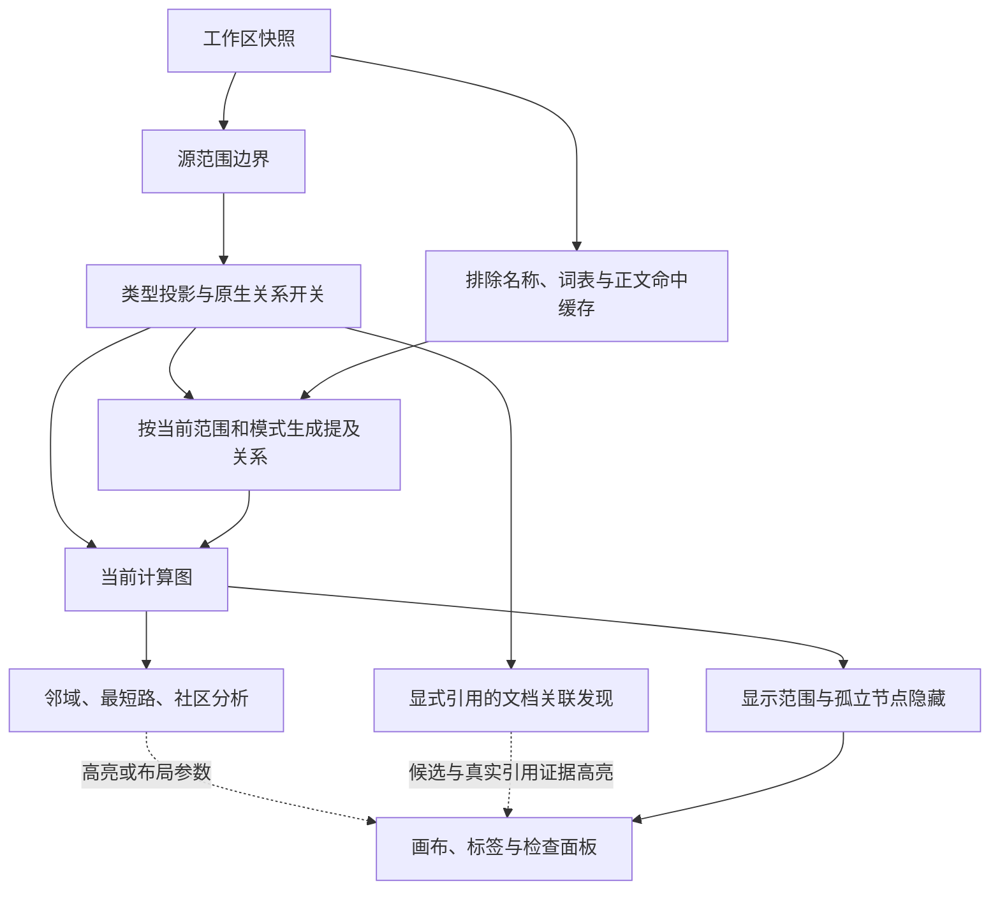

# 过滤、投影与显示流程

这份文档说明当前功能的顺序和作用域，供新增过滤器、关系和图算法时参考。
成本见 [功能与复杂度速查](feature-complexity.md)。这里的“投影”指把源块表示为图上节点，不是相机的 2D/3D 投影。

## 从数据到画面

工作区读取先按唯一块 ID 建立节点。同一 ID 的重复索引记录在分页前合并，保留最大行号的完整记录，
并在读取诊断报告冲突；这不会修改笔记或索引，也不保证所取记录是最新正文。
读取分页异常属于源数据阶段，调整邻域跳数不重新读取数据；邻域数量截断则只影响当次高亮结果。

这是语义依赖顺序，不要求每次从头计算：包含索引、词表、正文命中等有独立缓存。
协调入口是 [use-workbench-state.ts](../apps/siyuan-plugin/src/workbench/model/use-workbench-state.ts)。

| 层级 / 控件                         | 作用对象与规则                                                                         | 是否改变计算图                           |
| ----------------------------------- | -------------------------------------------------------------------------------------- | ---------------------------------------- |
| 搜索建图边界                        | 原始搜索命中加完整祖先链，与其他源范围条件取交集；不自动加入兄弟或后代                 | 是                                       |
| 笔记本、范围 ID、包含子文档         | 选择原始来源；范围 ID 包含自身和后代，关闭子文档会在子文档处停止向下展开               | 是                                       |
| 排除 ID                             | 排除指定块/文档及其完整子树；排除子树始终包括子文档，不受“包含子文档”开关缩减          | 是                                       |
| 块类型、仅文档                      | 原始来源仍须先满足上面的条件；隐藏的原生块将关系端点投影到所属文档。文档始终可作为代表 | 是，表示方式和路径跳数可能变化           |
| 引用、包含、数据库关系              | 选择启用的原生边种类；关闭的关系不参与邻域、路径或社区分析                             | 是；数据库开关还控制逻辑数据库实体的准入 |
| 提及排除规则与模式                  | 排除候选名称后派生提及边；关闭 / 已选节点 / 范围内全部使用同一索引                     | 是，只影响派生提及边                     |
| 隐藏未选中孤立节点                  | 在当前显示范围内按启用关系判断是否有关联边；已选且仍合格的孤立节点保留                 | 否，仅改变可见子集                       |
| 图内标题/ID 搜索                    | 搜索当前可见节点，显示最多 30 条定位结果；不是搜索建图入口，也不是图的过滤条件         | 否                                       |
| 邻域方向/跳数、路径高亮             | 在当前计算图上查询，结果用于高亮；扩大跳数不会越过源范围，也不会只留下高亮节点         | 否                                       |
| 关联发现                            | 按范围内显式引用汇总文档对，逐个起点比较共同引用目标或来源；查看候选仅高亮实际证据     | 否；明确加入已选才改变选择               |
| 颜色、标签避让、社区聚合/背景、相机 | 改变呈现和布局；标签不显示并不等于节点被排除                                           | 否                                       |

## 源范围优先于类型投影

[projectGraph / searchAncestorIds](../apps/siyuan-plugin/src/core/scope/graph-model.ts) 维护不同集合：

- `sourceIds`：允许参与的原始来源，作为原生关系和提及证据的边界。
- `representatives`：原始来源到显示身份的映射，允许一个文档代表多个被隐藏的块。
- `eligibleIds`：投影后可选择的身份；类型隐藏导致原块不再可选时，会移除该选择，不自动选择代表文档。

例如只允许块 A，隐藏其类型后显示所属文档 D：D 的出现不允许同文档的块 B 进入图，也不允许 B 的引用或正文提及进入图。
若 D 本身被排除，则也不能用 D 作代表。不能先把整个文档合并，再按 A 过滤，否则会把范围外证据带进来。

数据库和数据库条目是独立逻辑实体，不伪造所属文档。原生块范围/搜索边界同样约束它们；笔记本或排除条件下，还按真实数据库连接检查可达性。

## 关系组装和提及内部顺序

原生关系先检查两端原始身份均在源范围内，再映射端点，按“关系种类 + 有向端点”合并权重并保留来源证据。
包含关系单独沿真实父链找到最近的合格可见祖先，跳过的中间祖先记录在证据中；关闭包含边不会关闭用于范围判断和搜索补祖先的结构索引。

文本提及的顺序见 [索引](../apps/siyuan-plugin/src/modules/mentions/mention-index.ts) 和 [图集成](../apps/siyuan-plugin/src/modules/mentions/graph-integration.ts)：

1. 从文档标题、原生名称、各个别名提取并归一化候选名称；先应用普通词组和正则排除，再占用词表和命中预算。排除一个名称不删除节点，也不排除该节点仍可用的其他别名。
2. 从段落、标题块、表格的普通正文匹配词表；代码、链接、显式块引用、属性和 HTML 等不作为普通提及文本。保留重叠命中供后续按范围判断。
3. 查询时同时限制源和目标为当前 `sourceIds` 且具有显示代表；检查自身/所属文档名称以及单字符大小写，之后按当前范围解决最长名称重叠。范围外的长名称不会压制范围内的短名称。
4. 再应用“已选节点”模式：允许触及所选显示节点或所属文档的提及；不是只扫描所选块的正文。未选中的长名称仍可能压制所选短名称，因为重叠已在上一步解决。
5. 去掉自身/所属文档目标、投影后同端点关系；同方向端点已有当前启用的显式引用时，不再增加提及边。关闭引用后，这项抑制也随当前原生图变化。
6. 按显示端点汇总提及边、权重、歧义和来源证据，遵守边数/证据预算，然后附加到当前计算图。

因此顺序不能任意交换：词组排除应在预算之前，范围判断应在重叠判断之前，已选模式应在重叠判断之后。
普通选择通常只影响高亮；启用“已选节点”提及模式时，改变选择还会改变提及边，进而更新拓扑和依赖它的分析。

## 计算图与可见图

邻域和路径消费投影后启用的关系，每条关系计 1 跳；Rust 内部去掉自环并合并重复有向端点。
路径描述的是当前表示层级的连通关系，不保证等同于原始块层级的逐条引用链。
社区分析从同一当前图另建无向、去重、单位权连接，不改变原图的方向或权重。

工作台直接复用当前计算图的只读 `eligibleIds` 作为显示背景，由 [createViewProjector](../apps/siyuan-plugin/src/core/scope/graph-model.ts) 隐藏未选中的孤立节点，不再次遍历源范围。
邻域/路径高亮不参与这个删减，也不是显示投影器的输入。图内定位、画布和 JSON 导出使用可见图；邻域、路径和社区使用当前计算图。
标签避让是更晚的画布行为，不影响这两张图。

## 关联发现的输入与证据

[关联发现](../apps/siyuan-plugin/src/modules/discovery/reference-graph.ts) 使用提及合成前的
当前投影图，只取已启用的显式引用。端点映射到这张图中可用的文档，去掉同文档引用，
按有向文档对去重；每对保留全部原有显示边和出处。选中块可映射到可用的所属文档，
不具备可用文档的选择跳过，多个同文档起点合并。它不为此重新读取或展开整个文档。

因此，搜索中块 A 由文档 D 代表时，发现结果仍不能借 D 纳入范围外块 B 的引用。
包含、数据库和文本提及不参与得分；关闭引用时面板提示开启。显示层的孤立节点隐藏、
邻域深度、遍历方向与相机不改变所用引用事实，两种发现规则各自规定引用方向。

“引用相同资料”比较不同文档的出向引用集合；“被共同引用”比较入向来源集合。
多起点分别比较，候选按最佳加权重合度排序，并保留每个匹配起点的依据；
已选文档不会再次成为候选。分数不是语义相似概率，也不建立 A 与 B 的新图边。

查看候选仅用实际引用边及其端点临时高亮，不扩展出它们的其他相邻边，不改变已选集合或固定位置。
清除或关闭后恢复当前普通高亮。用户明确“加入已选”才增加候选文档；这会照常触发
依赖选择的邻域、层级布局及“已选节点”提及模式。原始出处沿用关系检查面板。
结果和证据绑定准确的图、规则和起点请求；刷新、变更范围/选择/规则或关闭面板会取消旧任务。

## 按需检查与排除预览

筛选面板的 **检查节点或关系** 使用 [与建图共享的判断](../apps/siyuan-plugin/src/core/scope/source-eligibility.ts)，按原始数据、源范围、类型投影、显示顺序解释节点。第一次失去源资格后停止；作为范围内块代表而出现的文档会单独说明，避免把“原始来源被排除”误报成“画面上一定不存在”。不会为检查重新建图。

可选目标 ID 用于检查从起点到目标的直接关系：原始端点的原生关系与投影后显示端点的关系分开列出。包含边会按最近可见祖先重建；提及关系只报告当前最终结果和索引状态，不把没有结果推断为某一个词法规则的失败。

提及排除编辑器在输入停顿后显示整组草稿的匹配名称数与原始节点数，**查看详情** 打开可查找、分页的 modal，列出名称、原始节点/所属文档和一条足够排除它的规则。预览作用于整个已读取工作区中受支持的候选名称，位于范围过滤和正式词表预算之前；并非仅统计当前可见节点，也不是受影响边数。不同原始节点的同名名称仍逐个列出。

预览复用实际名称提取、归一化、名称支持条件和排除判断，但拥有独立的名称目录与 Worker；草稿、检索或页码改变不会覆盖已应用规则或正式提及索引。取消、超时、关闭面板或切换预设会释放正在运行的预览任务；只接受当前源、请求和页码的结果。点击 **应用排除** 仍是改变图的唯一操作。

## 保存与更新

普通筛选规则和显示孤立开关跟随预设；图内搜索词、选择、相机不属于预设。
提及词组与正则分别保存在 `excludedMentionPhrases` 和 `excludedMentionPatterns`，旧预设缺少正则字段时取空列表，旧斜杠词组保留字面含义。
编辑器中一行一个普通词组或 `/正则/`，点击应用才重算，详见 [使用说明](../apps/siyuan-plugin/public/README_zh_CN.md)。

搜索图由 [FilterSessions](../apps/siyuan-plugin/src/application/workflows/filter-sessions.ts) 持有独立临时规则，默认显示所有类型并启用包含；切回时恢复普通预设及未保存修改。
搜索命中 ID 保持最初收集的集合；源快照更新会重新求它们的祖先，不会自动执行新的搜索。
异步索引和查询通过 source/rule/scope/request 的对应版本拒绝过期结果；语言、悬停和相机不应成为语义缓存输入。
