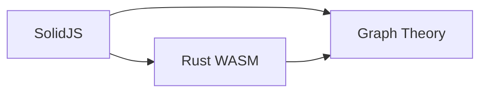
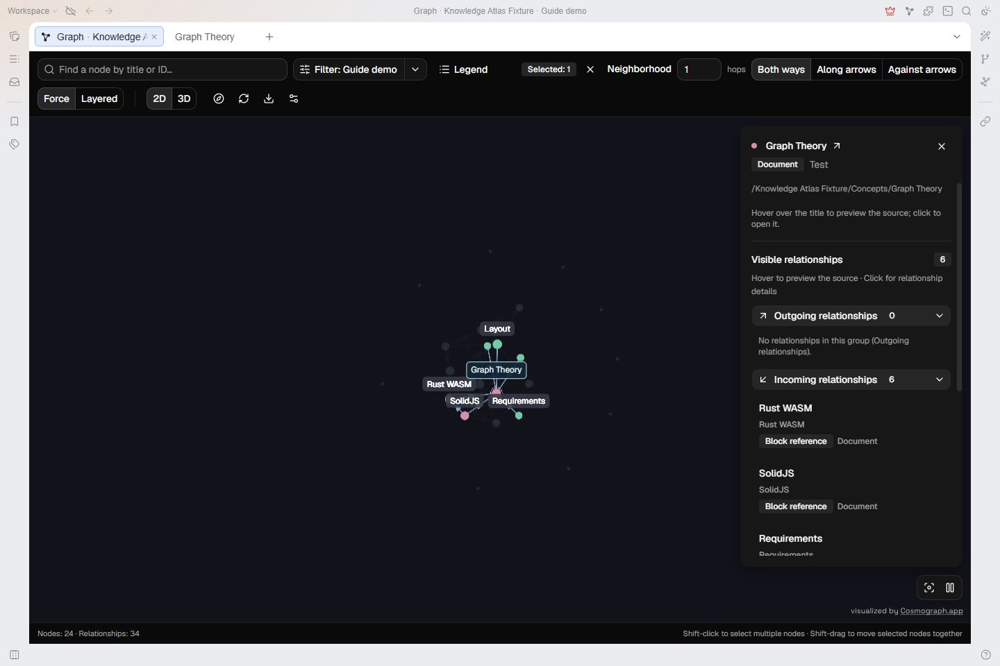
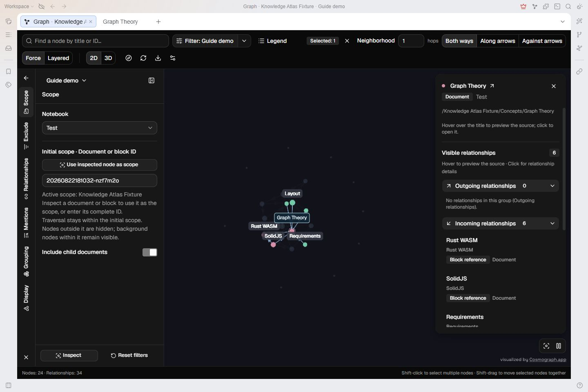
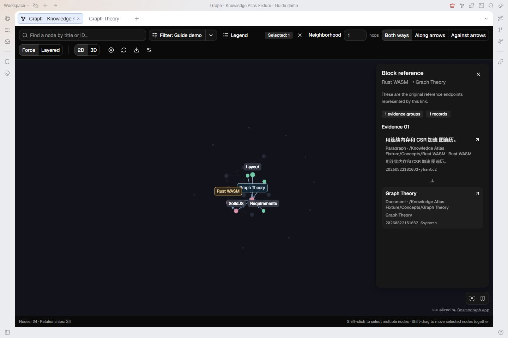
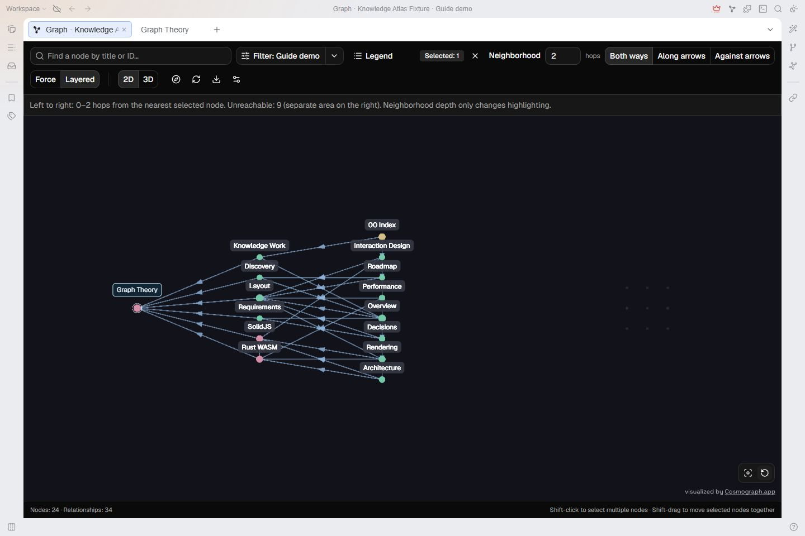
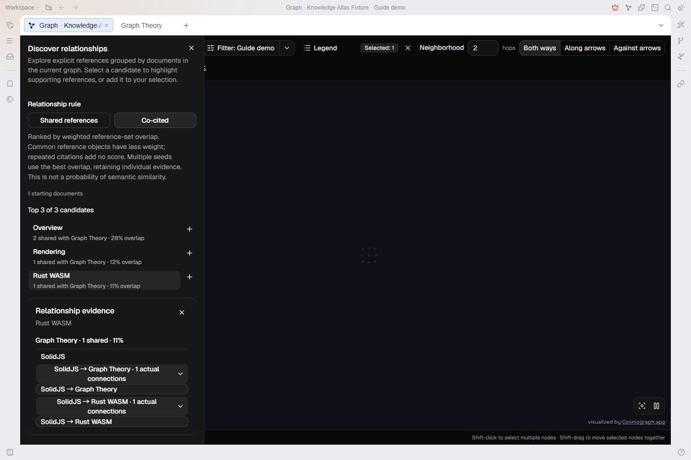
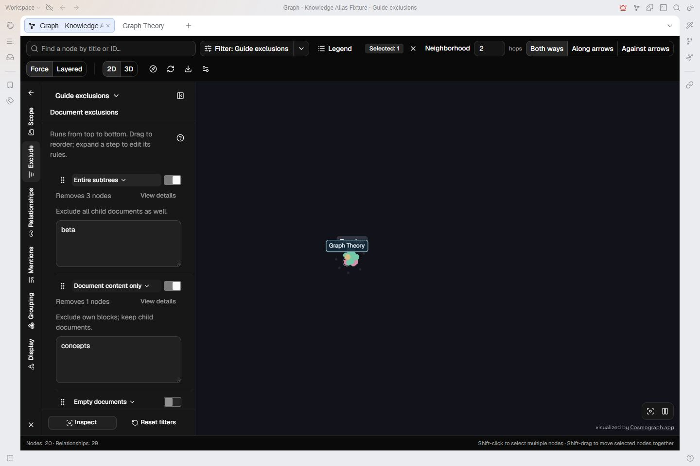
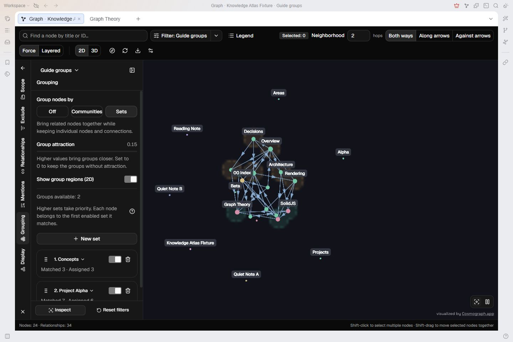
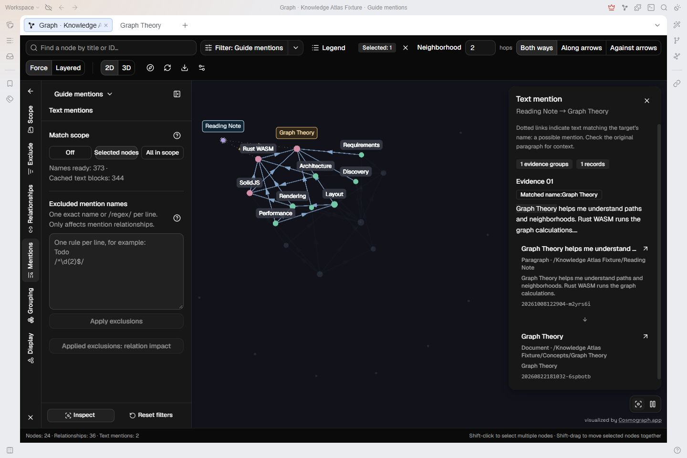
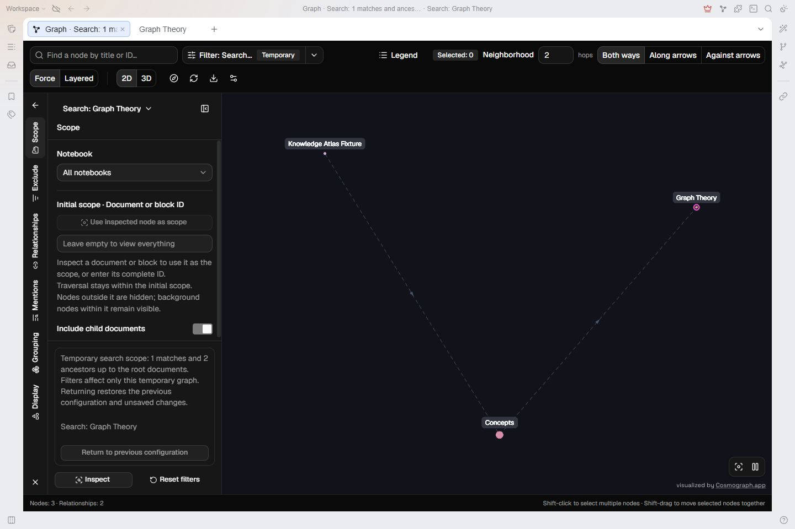

# Another Graph · User guide

Put references, document structure, and other relationships on a graph. Start from a topic, follow its connections, then return to the notes to check the evidence.

[简体中文](user-guide_zh_CN.md) · [Overview](../README.md) · [Mouse and keyboard](mouse-keyboard.md)

## Start with a small example

These screenshots use the SiYuan test workspace's `Test / Knowledge Atlas Fixture` and a separate `Guide demo` preset. The scope contains demonstration notes. Three example documents contain these **explicit block references**:



- `Graph Theory` is the topic note.
- `Rust WASM` references `Graph Theory`.
- `SolidJS` references both, providing co-citation evidence.

To follow along, create these three documents in your own workspace and insert SiYuan block references between them. Writing a title as plain text does not create an explicit reference; those connections require Text mentions. Screenshots include additional demonstration notes, so your counts and positions need not match.

## Get started in three steps

1. Enable the plugin in desktop SiYuan. Click the **Another Graph** toolbar icon or press **Alt+Shift+G**; on macOS, use **Option+Shift+G**.
2. Search for `Graph Theory` in the graph and click the result. Clearing the query keeps the selected node.
3. Set **Neighborhood** to `1` and choose **Both ways**. The canvas highlights one-hop connections; the right panel lists the inspected node's relationships.



_Graph Theory is the selected starting node. Incoming relationships lists notes that reference it. Dimmed nodes remain in scope._

Graph search locates nodes already in the current graph; it does not replace the graph with the results. It reports the full match count and displays **50 results per page**. A new query returns to page one. Press `↓` to enter the results, `Enter` to choose one, and `Esc` to return to the input.

Alternatively, choose **View in graph** from a document title, document tree, or block context menu to use that document or block as the scope.

## Choose starting nodes and follow a neighborhood

Keep these operations separate:

| Operation       | Purpose                                                                                                                                   |
| --------------- | ----------------------------------------------------------------------------------------------------------------------------------------- |
| Selected nodes  | Starting nodes for neighborhoods, layered layout, and discovery. They have persistent labels and fixed positions.                         |
| Inspection      | Check an object's type, connections, and sources. In multi-select mode, a normal click changes inspection while keeping the selected set. |
| Scope filtering | Decide which content can enter the graph. More hops do not bring in nodes outside it.                                                     |

In ordinary single-select mode, clicking a node selects it and opens its details. **Shift-click** adds or removes a starting node. After entering multi-select mode, a normal click only changes inspection, even when one selected node remains. Use **Clear selection** or **Shift-double-click the background** to return to ordinary single selection.

### Directions and hops

Reference arrows point from the reference's source to its target, such as `Rust WASM → Graph Theory`.

| Direction      | Follow                                    | In the three-note example                     |
| -------------- | ----------------------------------------- | --------------------------------------------- |
| Both ways      | Either direction                          | Graph Theory reaches Rust WASM and SolidJS.   |
| Along arrows   | Connections leaving the starting node     | Rust WASM reaches Graph Theory.               |
| Against arrows | Connections pointing to the starting node | Graph Theory reaches notes that reference it. |

Change Neighborhood from `1` to `2` to highlight two-hop connections. Each enabled relationship costs one hop; repeated reference records do not add hops. Choose the participating relationships in **Filter → Relationships**.

### Common canvas actions

| Action                                                    | Result                                       |
| --------------------------------------------------------- | -------------------------------------------- |
| Drag empty canvas                                         | Pan in 2D; rotate in 3D.                     |
| Hold `Space` and drag                                     | Pan, including in 3D.                        |
| Mouse wheel                                               | Zoom.                                        |
| Drag a node's circle                                      | Move that node.                              |
| **Shift-drag** from a selected circle or persistent label | Move all selected nodes together.            |
| Double-click a node or label                              | Open its SiYuan source.                      |
| Right-click a node or label → **Copy ID**                 | Copy its full ID without changing selection. |
| **Fit to canvas**, at the bottom right                    | Bring the current graph into view.           |
| Pause/resume control, at the bottom right                 | Stop or resume force motion.                 |

To regain an overview, clear selection and use Fit to canvas.

## Narrow the scope and save a preset

For a crowded graph, first decide which notes belong to this exploration.

1. Click **Filter: current preset name** to open the left editor.
2. Choose **Scope** and a notebook; the example uses `Test`.
3. Enter a category document or block's full ID. The example scope is `Knowledge Atlas Fixture`.
4. Enable **Include child documents** to include notes below that document.
5. **Update preset** to save this configuration, or **Save as preset** to retain another version.



_Only Knowledge Atlas Fixture and its descendant documents are in scope. Use inspected node as scope would switch to the currently inspected document._

You can first inspect a native document or block and choose **Use inspected node as scope**. Synthetic nodes and relationship inspection do not provide this shortcut. Clearing the ID restores the selected notebook's full scope; notebook and child-document options retain their current values.

**Include child documents** determines which content enters the scope. **Containment** in Relationships determines whether parent-child connections are drawn.

| Editor category     | Main controls                                                               |
| ------------------- | --------------------------------------------------------------------------- |
| Scope               | Notebook, document/block ID, and child documents.                           |
| Document exclusions | Remove document contents, subtrees, or empty documents from the graph.      |
| Relationships       | Enable references, containment, and database relations.                     |
| Text mentions       | Add possible connections from titles, names, and aliases appearing in text. |
| Grouping            | Organize positions with communities or custom sets.                         |
| Node display        | Choose document/block types and hide isolated nodes.                        |

### Apply and save are different steps

- Ordinary scope and relationship controls take effect immediately. Exclusion text and set names/rules need **Apply exclusions** or **Apply set** first.
- **Not applied** identifies a draft the graph is not yet using.
- **Preset not saved** identifies an active configuration not yet saved to the preset.
- **Update preset / Save as preset** saves applied filters and grouping; it does not apply drafts.

Changing categories or collapsing the current category keeps drafts. Close, Back, and `Esc` offer **Continue editing** or **Discard drafts and exit** when unapplied drafts exist. Applied but unsaved changes remain.

Use the **chevron next to the filter button** to switch or manage presets. Create, copy, rename, or delete presets there. Deletion does not delete notes; **Undo** in the notification restores a just-deleted preset. New presets start with documents only, containment off, and text mentions off.

Toolbar groups wrap in narrower windows. Expanded filter content may temporarily hide the inspector; closing or collapsing it restores the same inspected object and keeps the selected starting nodes.

## Trace a connection to its source

A document-level line may aggregate references from several blocks. Check its origin:

1. Select `Graph Theory` and find `Rust WASM` under Incoming relationships.
2. Click the entry to inspect **Rust WASM → Graph Theory**.
3. Check the source paragraph and target block. Click a source entry to open it, or hover an entry with preview support to preview it.



_This line comes from an actual block reference, rather than similar titles. Note content stays in its original language._

| Relationship      | Meaning                                                                        |
| ----------------- | ------------------------------------------------------------------------------ |
| Block reference   | An explicit SiYuan reference, directed from source to target.                  |
| Containment       | Document/block parent-child structure, shown with dashed lines.                |
| Database relation | A native database/item connection with inspectable endpoints.                  |
| Text mention      | A possible connection from a title, name, or alias in text; enable separately. |

Node colors depend on the coloring settings. Use arrows, the legend, and details to identify relationship types, directions, and sources.

### Find a shortest path

Expand **Path finder** at the bottom of node details. Enter the target's **full title or ID**, then **Find path**. The target must be in the current computation scope.

Select `Graph Theory`, choose Both ways, and target `Rust WASM`: the example has a one-hop path. With Along arrows, Graph Theory has no outgoing reference, so that route is unreachable. Paths also follow enabled relationships and exclusions.

## Read distances in layered layout

Force helps you browse overall structure. Layered shows distances from the selected starting nodes.

1. Select `Graph Theory` and choose Both ways.
2. Click **Layered**. Nodes run left to right by the fewest hops from the nearest starting node.
3. Change Neighborhood to adjust highlighting; use **Rearrange layers and fit** to restore the arrangement and view.
4. Switch **2D / 3D** for columns or spatial planes. Return to **Force** for free motion.



_Layer zero is the starting node. Layer one connects directly; layer two uses an intermediate node. Unreachable nodes occupy a separate area on the right._

**Neighborhood depth changes highlighting, not the extent of layer calculation.** All selected nodes are equal starting nodes, and each node uses the nearest one's distance. Select a starting node before using Layered. Changing starting nodes, direction, scope, or dimension rearranges the graph. Returning to Force restores its parameters and pause state.

## Discover related documents

**Discover relationships** finds documents with common explicit-reference evidence. It is separate from neighborhood highlighting and semantic search.

| Rule              | Structure | Example                                        |
| ----------------- | --------- | ---------------------------------------------- |
| Shared references | A → X ← B | Rust WASM and SolidJS reference Graph Theory.  |
| Co-cited          | A ← X → B | SolidJS references Graph Theory and Rust WASM. |

Try Co-cited:

1. Select `Graph Theory` and open Discover relationships.
2. Choose **Co-cited**, then select the `Rust WASM` candidate.
3. Expand the `SolidJS` evidence and its two actual connections.
4. Use **+ / Add to selection** to continue from the candidate. Inspecting its evidence alone does not change the starting set.



_SolidJS supplies two references. Overlap is a ranking score, not a probability of semantic similarity._

To try Shared references, start with `Rust WASM`. Graph Theory has no outgoing reference in this example, so getting no result for that rule with Graph Theory is expected.

Enable block references: discovery uses explicit document references inside the current boundary. Selected blocks use their available owning documents. Text mentions, containment, and database relations do not contribute to scores. Closing the panel or clearing its highlight restores ordinary highlighting.

## Exclude categories, archives, and empty documents

Exclusions change the graph without deleting or editing notes. **Filter → Document exclusions** has three independently enabled, reorderable steps:

| Step                  | Effect                                                                | Use it for                                    |
| --------------------- | --------------------------------------------------------------------- | --------------------------------------------- |
| Document content only | Remove matching documents and their own blocks; keep child documents. | Hide category documents.                      |
| Entire subtrees       | Remove a matching document/block and all descendants.                 | Leave an archive or old project out of scope. |
| Empty documents       | Hide documents without body content; keep child documents.            | Reduce empty category nodes.                  |

For example:

1. Enter `Concepts` in Document content only: keep Graph Theory, Rust WASM, and SolidJS while hiding their category.
2. Enter `Beta` in Entire subtrees: remove Beta, Discovery, and Roadmap.
3. Review the preview, then **Apply exclusions**. Update a preset or save as `Guide exclusions`.



_This scope loses one node in the contents-only step and three in the subtree step: four in total. Counts belong to this example, not to the rules themselves._

Each line accepts a full ID, title substring, or `/regex/`. Regex matches normalized titles case-insensitively; do not append flags after the closing slash. For example:

```text
/^\d{4}-\d{2}$/
```

matches a category such as `2026-10`. Prefix literal rules beginning with `/` or `\` with one extra `\`. A block ID removes the block and descendants in either step; document IDs follow the contents/subtree distinction.

**View details** separates nodes removed in this step, removed earlier, matched, and retained for connections. It supports search, paging, copying IDs, and opening sources. Steps run top to bottom and count overlaps once. Drag a handle, or focus it and press `↑ / ↓`, to reorder.

**Keep empty documents needed for connections** is on by default. It may keep empty documents connecting other nodes, using enabled reference, containment, and database relationships. Text mentions do not participate. Titles and child documents are not body content; images, attachments, code, math, and databases are not treated as empty content.

## Bring related nodes together

In **Filter → Grouping**, choose **Communities** to group by connections or **Sets** to specify membership. Grouping preserves individual nodes, their colors, and connections; it does not collapse a group into one node.

Practice with two sets:

1. Add `Concepts` in Sets and apply:
   ```text
   /^(Graph Theory|Rust WASM|SolidJS)$/
   ```
2. Add `Project Alpha` and apply:
   ```text
   /^(Rust WASM|Architecture|Layout|Rendering|Requirements|Overview|Decisions)$/
   ```
3. Keep Concepts first. Project Alpha matches seven nodes but owns six: Rust WASM already belongs to Concepts.
4. Move Project Alpha to the top by dragging its handle or pressing `↑` on it. It now owns Rust WASM. Move it back down to restore ownership.
5. Adjust attraction and optionally enable **Show group regions (2D)**. Save the preset to retain the mode, rules, enabled states, and order.



_Each node belongs to the first enabled matching set. Guide groups stores these example sets._

Rules within a set form a union. **Native document/block IDs** include themselves and all descendants in the original containment tree. **Titles and regex** match individual nodes without expanding to child documents. Database and item IDs match exactly. Sets only group nodes in the current graph and cannot restore exclusions.

Attraction needs a running **Force** layout: resume motion if paused or return from Layered. Attraction `0` preserves membership without a group force. Territories are available in 2D only.

## Add possible connections with text mentions

For notes that name other notes without inserting references, open **Filter → Text mentions**:

- **Off** uses other enabled relationships only.
- **Selected nodes** generates mentions in selected documents. Selecting blocks includes incoming/outgoing mentions related to those blocks.
- **All in scope** looks across the current scope, potentially adding many connections.

Create a `Reading Note` with this plain paragraph, without inserting block references:

`Graph Theory helps me understand paths and neighborhoods. Rust WASM runs the graph calculations.`

Keep it and both target notes in scope, select Reading Note, and enable **Selected nodes** to see connections formed by the names in its text.



Matching uses titles, names, and individual aliases. Inspect the source passage to judge its relevance; same-name candidates are marked as ambiguous.

Exclude unhelpful names with one **complete phrase** or `/regex/` per line, then Apply exclusions:

```text
To do
/^\d{2}$/
/^\d{4}-\d{2}-\d{2}$/
```

The two-digit rule does not exclude `101` or `Project 01`. Rules filter candidate names, rather than directly deleting nodes or explicit references. Previewed name/node counts are not removed-edge counts; previews can include acquired candidates outside the current scope.

**Applied exclusions: relation impact** compares removed and added mentions. Excluding a longer name can allow another match to appear, so exclusions do not necessarily only reduce lines. Apply first, then save; presets keep independent rules.

## Build a graph from search results

Graph search locates existing nodes. **Graph all results** in **SiYuan native search / HZ Simple Search** creates an independent temporary scope.

1. Run a native search or [HZ Simple Search](https://github.com/Hug-Zephyr/HZ-syplugin-simple-search) query. To reproduce this small example, enable only **Document block** in native **Search type** and search for `Graph Theory`.
2. Click **Graph all results** in the search tab/dialog. Click again during reading to cancel.
3. Explore matches and ancestors. A **magenta outer ring** marks a search match; a document representing a hidden matching block is marked as a projected match.
4. **Return to previous configuration** restores the original preset and its unsaved changes.



_The example searches for Graph Theory. Matching nodes and ancestors added for context have different roles._

Every supported result page is read. The initial search graph shows all types and enables containment. Rebuild after changing the query; **Refresh graph** only rereads the original matched IDs. Temporary search configurations last for the current session and are replaced by the next search graph, without overwriting ordinary presets.

If pagination is reported as incomplete, do not treat partial results as every match. Check whether search types include container blocks that can return repeated content, narrow the query, and search again. This small example searches document blocks only.

## Adjust the view, export, and recover

**Filter → Node display** controls document/block types. A document can represent hidden blocks while its connections remain traceable to their original endpoints. **Hide isolated nodes** affects display without changing the neighborhood/path computation scope.

**Graph settings** adjusts coloring, node size, labels, and force parameters. **Legend** explains current nodes and relationships. Reduce label density for an overview; select nodes for persistent labels and closer inspection.

**Export current graph** downloads the visible graph as JSON, generating a temporary export file without creating SiYuan notes. **Refresh graph** rereads the workspace after note/index changes.

| Symptom                                       | First check                                                                                                      |
| --------------------------------------------- | ---------------------------------------------------------------------------------------------------------------- |
| A node is missing from graph search           | Notebook, scope, exclusions, and display types. Graph search only searches the current graph.                    |
| More hops do not reach an outside note        | Expand the scope and enable the required relationships.                                                          |
| No path or discovery candidate                | Direction and block references. Graph Theory has no outgoing reference here.                                     |
| Clicking does not replace the starting node   | Clear multi-selection, then select normally.                                                                     |
| Layers do not arrange / groups do not attract | Layers need a starting node; attraction needs running Force motion and nonzero attraction.                       |
| Saved rules do not take effect                | Apply drafts before saving.                                                                                      |
| The graph is empty                            | Existing scope, open notebooks, display types, and exclusions. Use the filter explanation tool to inspect an ID. |
| A read notice appears at the bottom left      | Check its objects, causes, and sources. Repair source/index issues and refresh; extra hops do not repair reads.  |

Acquisition reads the local index without changing note content or relationship fields. Diagnostics report partial reads, truncation, and duplicate block IDs. An incomplete graph is not the full dataset.

## Requirements and limits

Requires desktop SiYuan **3.8.3+** and WebAssembly exception handling (EH). Screenshots were captured in a Windows test workspace running **3.8.6**. The interface follows SiYuan's language, supporting Simplified Chinese and English; note content and custom names are preserved.

| Area                | Current limit                                                                                                                 |
| ------------------- | ----------------------------------------------------------------------------------------------------------------------------- |
| Graph search        | Full match count; 50 results per page.                                                                                        |
| Document exclusions | 2,000 combined rules, 128 regex rules, 256 characters per entry; background regex matching has a 10-second limit.             |
| Mention exclusions  | 2,000 phrases, 128 regex rules, 256 characters per entry; regex preparation has a 10-second limit.                            |
| Custom sets         | 50 sets per preset, 2,000 combined rules, 128 regex rules; matching has a 10-second limit.                                    |
| Discovery           | 128 starting documents; first 100 candidates. Supporting documents and canvas evidence edges have additional reported limits. |
| Search graphs       | 500,000 matches, 10,000 pages, or two minutes; incomplete/unsupported results are reported.                                   |

Responsiveness depends on hardware, structure, and settings. Search graphs do not support semantic search, encrypted-notebook search, or SQL that cannot be paged reliably. See the [filtering and projection reference](filtering-pipeline.md) for the processing order.

Project and third-party terms are in [LICENSE](../LICENSE) and [NOTICE](../NOTICE.md). Visualization uses [Cosmograph](https://cosmograph.app/), with attribution preserved on the graph.
