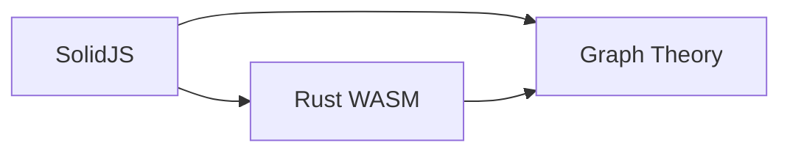
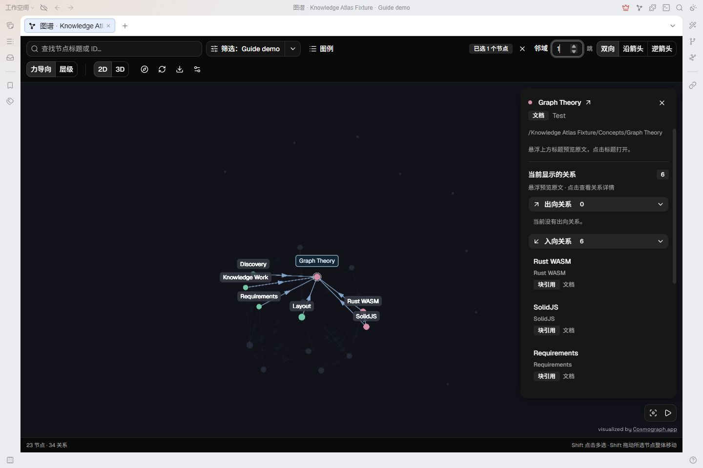
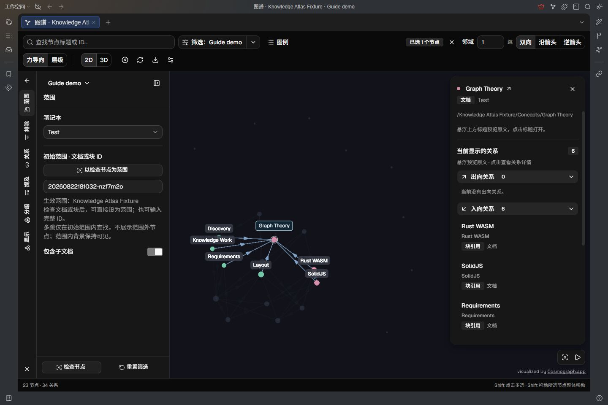
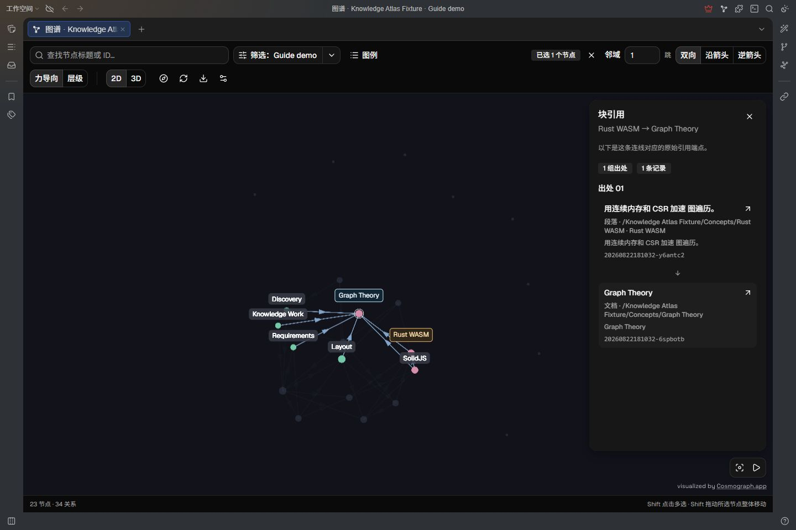
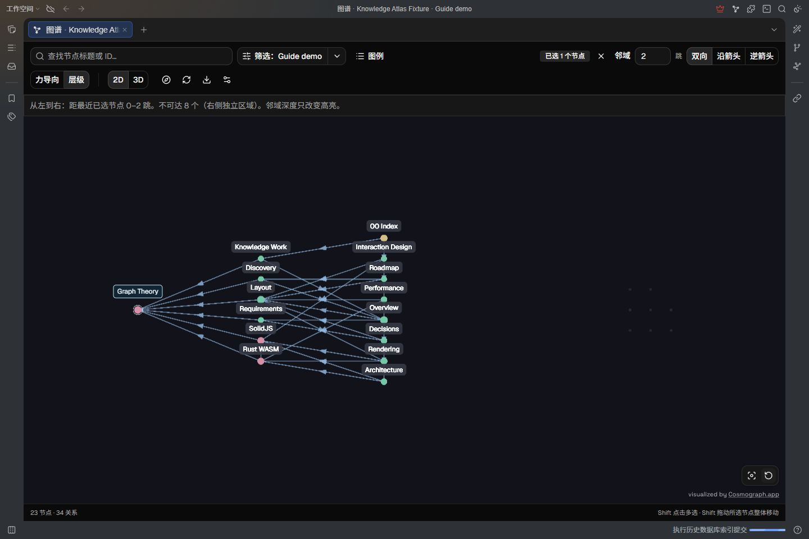
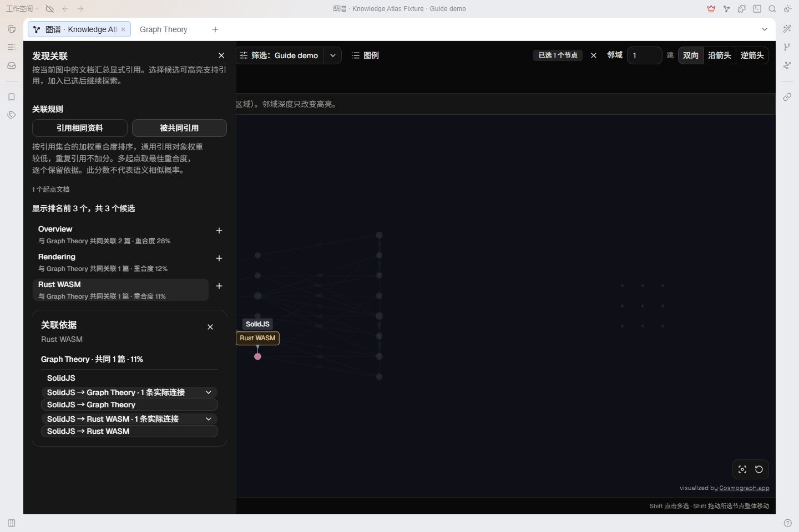
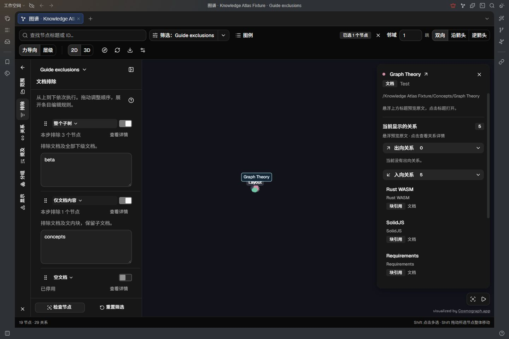
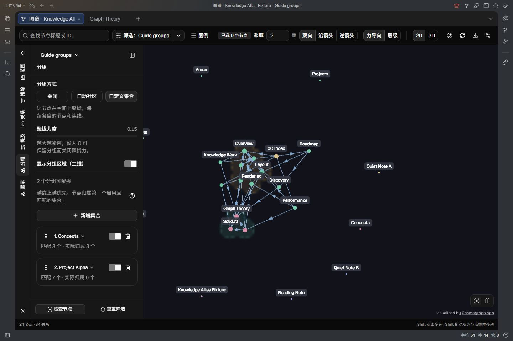
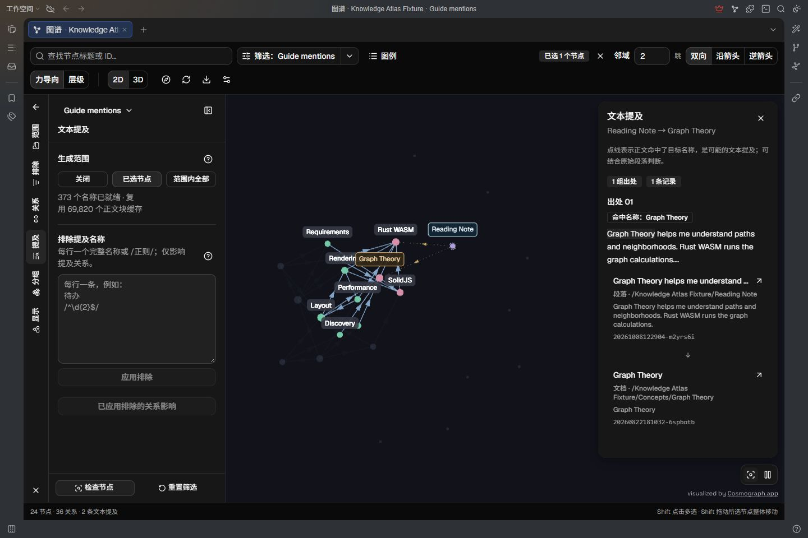
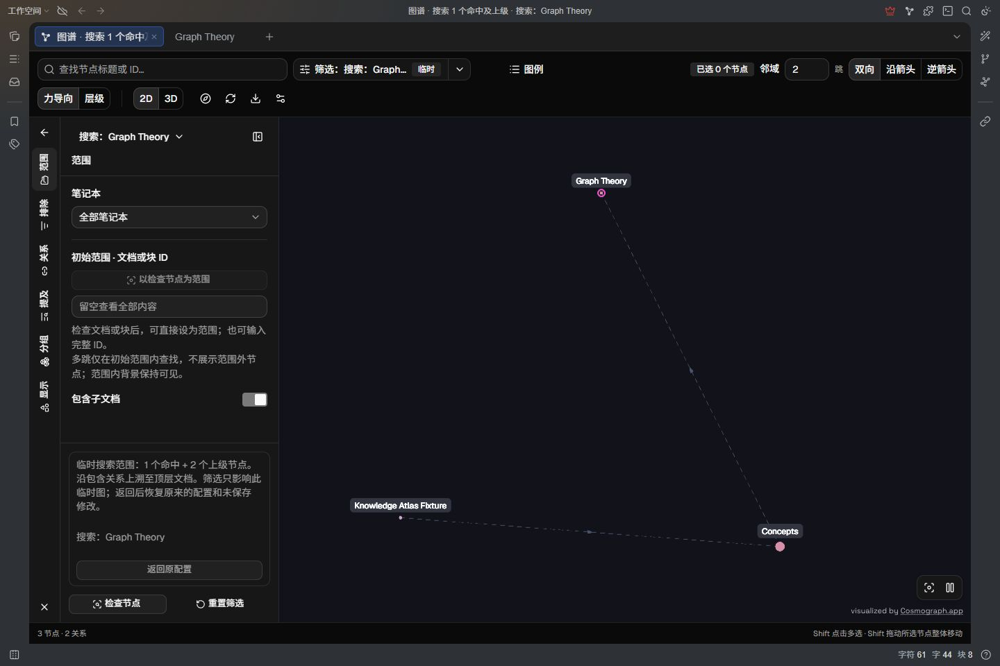

# 另一个图谱 · 使用指南

把笔记中的引用、上下级结构和其他关系放到图上，从一个主题出发，找到相邻内容，再回到原文核对依据。

[English](user-guide.md) · [功能概览](../apps/siyuan-plugin/public/README_zh_CN.md) · [鼠标与键盘操作](mouse-keyboard_zh_CN.md)

## 先准备一个看得懂的小例子

本文截图来自思源测试库的 `Test / Knowledge Atlas Fixture`，使用独立的 `Guide demo` 预设，只展示演示主题涉及的文档。示例中的三篇文档有这样的**显式块引用**：



- `Graph Theory` 是主题笔记。
- `Rust WASM` 引用了 `Graph Theory`。
- `SolidJS` 同时引用了两者，可以作为“被共同引用”的依据。

你可以在自己的工作区新建这三篇文档，用思源的块引用建立上述连接，再跟着操作。仅在正文中写出标题不会生成显式引用；这种联系需要另外开启“文本提及”。截图还包含其他演示文档，你的节点数量和位置不必与截图一致。

## 三步上手

1. 在桌面版思源中启用插件，点击顶栏的**另一个图谱**图标，或按 **Alt + Shift + G**。macOS 使用 **Option + Shift + G**。
2. 在图谱顶部搜索框输入 `Graph Theory`，点击搜索结果。清空搜索词后，已选节点仍保留。
3. 把**邻域**设为 `1`，方向设为**双向**。画布高亮一跳内的连接，右侧显示当前节点的关系。



_图中 Graph Theory 是已选起点，右侧的“入向关系”列出引用它的文档。暗下来的其他节点仍在当前范围内。_

图内搜索只用于定位当前图中的节点，不会把图裁成搜索结果。匹配结果每页显示 **50 项**，可以翻页；输入新查询会回到第一页。搜索框中按 `↓` 可进入结果列表，按 `Enter` 选择，`Esc` 返回搜索框。

也可以从思源文档标题、文档树或块的右键菜单选择**在图谱中查看**，直接以那个文档或块作为范围。

## 选起点、看详情、控制邻域

先分清三个不同的操作：

| 操作               | 用途                                                                       |
| ------------------ | -------------------------------------------------------------------------- |
| 已选节点           | 作为邻域、层级布局和发现关联的起点。已选节点有常驻标签，位置会固定。       |
| 查看节点或关系详情 | 检查对象的类型、连接和出处。多选状态下，普通单击只切换详情，保留起点集合。 |
| 筛选范围           | 决定图里可以出现哪些内容。增加邻域跳数不会带入范围外的节点。               |

普通单选时，点击节点会选择它并打开详情。**Shift + 点击**加入或移出已选集合；进入多选状态后，即使只剩一个起点，普通点击也只查看详情。用工具栏的**清空选择**，或 **Shift + 双击空白处**，回到普通单选。

### 箭头与跳数怎么用

引用箭头从引用者指向被引用内容，例如 `Rust WASM → Graph Theory`。

| 方向   | 从起点寻找什么 | 在三篇示例文档中                              |
| ------ | -------------- | --------------------------------------------- |
| 双向   | 两个方向都走   | 从 Graph Theory 能找到 Rust WASM 和 SolidJS。 |
| 沿箭头 | 起点指向的内容 | 从 Rust WASM 能找到 Graph Theory。            |
| 逆箭头 | 指向起点的内容 | 从 Graph Theory 能找到引用它的文档。          |

把邻域从 `1` 调到 `2`，可以继续查看两跳内的连接。每条启用的关系算一跳；重复引用的记录数量不会增加跳数。关系是否参与计算，由**筛选 → 关系**决定。

### 常用画布操作

| 操作                                          | 结果                          |
| --------------------------------------------- | ----------------------------- |
| 拖动空白处                                    | 2D 平移视图；3D 旋转视角。    |
| 按住 `Space` 拖动                             | 平移视图，包括 3D。           |
| 滚轮                                          | 缩放。                        |
| 拖动节点圆点                                  | 移动该节点。                  |
| 从已选节点圆点或常驻标签开始 **Shift + 拖动** | 一起移动所有已选节点。        |
| 双击节点或标签                                | 打开思源来源。                |
| 右键节点圆点或标签 → **复制 ID**              | 复制完整 ID，不改变当前选择。 |
| 画布右下角**适应画布**                        | 把当前图谱纳入视野。          |
| 画布右下角暂停／继续按钮                      | 暂停或恢复力导向运动。        |

想恢复整体视野时，先清空选择，再点击**适应画布**。

## 缩小范围，并保存成预设

整库图谱过密时，先确定“这次要研究哪一组笔记”。

1. 点击工具栏的**筛选：当前预设名**，打开左侧编辑栏。
2. 进入**范围**，选择笔记本。示例选 `Test`。
3. 填入分类文档或块的完整 ID。示例范围是 `Knowledge Atlas Fixture`。
4. 需要分类文档下面的内容时，开启**包含子文档**。
5. 点击**更新预设**保存当前配置，或用**另存为预设**保留另一套配置。



_示例只展示 Knowledge Atlas Fixture 及其下的文档。右侧正在检查的文档可通过“以检查节点为范围”直接填入，但那会改变范围。_

你也可以先检查一个原生文档或块，再点击**以检查节点为范围**。合成节点和关系详情不能用作这个快捷入口。清空 ID 可恢复所选笔记本的全部范围；笔记本和子文档开关仍保留当前值。

**包含子文档**决定哪些内容进入范围；**关系**里的**包含关系**决定是否画出上下级连接，两者用途不同。

编辑栏的六个分类分别处理：

| 分类     | 主要操作                                   |
| -------- | ------------------------------------------ |
| 范围     | 选择笔记本、文档或块，以及是否包含子文档。 |
| 文档排除 | 隐藏不需要的文档内容、子树或空文档。       |
| 关系     | 开关块引用、包含关系和数据库关系。         |
| 文本提及 | 从正文中的标题、名称和别名补充可能的联系。 |
| 分组     | 用自动社区或自定义集合组织节点位置。       |
| 节点显示 | 选择文档／块类型，隐藏孤立节点。           |

### 应用和保存是两件事

- 普通范围、关系等开关修改后直接生效；排除文本和集合名称／规则要先点**应用排除**或**应用集合**。
- **未应用**表示编辑框里还有草稿，图谱尚未使用这些规则。
- **预设未保存**表示配置已生效，但尚未保存到当前预设。
- **更新预设／另存为预设**只保存已应用的筛选和分组，不会自动应用草稿。

切换分类或再次点击当前分类收起内容，都会保留草稿。关闭编辑栏、返回预设或按 `Esc` 时，如果有未应用草稿，会提供**继续编辑**和**丢弃草稿并退出**；已应用但未保存的修改仍保留。

点击筛选按钮右侧的**下拉箭头**才是切换／管理预设菜单。可以新增、复制、重命名或删除预设；删除预设不会删除笔记，通知中的**撤销**可恢复刚删除的预设。新增预设从仅文档、关闭包含关系和文本提及的配置开始。

窗口变窄时，工具栏按功能块换行。窄窗口展开筛选内容会暂时隐藏详情面板；关闭或收起后恢复同一个检查对象，已选起点不丢失。

## 顺着关系回到原文

图上的文档连线可能汇总了文内多个块的引用。要确认它来自哪里：

1. 选择 `Graph Theory`，在右侧**入向关系**里找到 `Rust WASM`。
2. 点击这一条关系，查看 **Rust WASM → Graph Theory** 的出处。
3. 检查实际引用段落和目标块；点击出处可打开思源原文，悬停带预览的条目可预览来源。



_这条文档级连线来自 Rust WASM 中的实际引用段落，不是因为两篇笔记的标题相似。_

在**筛选 → 关系**中可以分别开启：

| 关系       | 表示什么                                             |
| ---------- | ---------------------------------------------------- |
| 块引用     | 思源中的显式引用，箭头从引用者指向目标。             |
| 包含关系   | 文档、子文档和文内块的上下级结构，使用虚线。         |
| 数据库关系 | 原生数据库及条目的连接，按实际端点查看。             |
| 文本提及   | 正文匹配标题、名称或别名形成的可能联系，需另外开启。 |

节点颜色由着色设置决定。判断关系类型、方向和来源时，以箭头、图例和关系详情为准。

### 查两篇笔记之间的最短路径

在节点详情底部展开**已有路径工具**，输入目标的**完整标题或 ID**，点击**查找路径**。目标必须在当前图的可计算范围中。

示例选择 `Graph Theory`，方向设为**双向**，目标填 `Rust WASM`，会得到一条一跳路径。改成**沿箭头**后，Graph Theory 没有出向引用，因此这条路径不可达。路径工具也遵循当前启用的关系和排除规则。

## 用层级看清距离

力导向适合浏览整体结构；层级适合回答“离这些起点有几跳”。

1. 选择 `Graph Theory`，方向设为**双向**。
2. 点击工具栏的**层级**，节点按距最近已选起点的最少跳数从左向右排列。
3. 调整邻域跳数查看高亮范围；点击**重新分层并适应画布**，恢复排列和视野。
4. 切换 **2D／3D** 查看列或空间平面；需要自由运动时切回**力导向**。



_第 0 层是起点，第 1 层与它直接相连，第 2 层需经过中间节点。当前关系下不可达的节点放在右侧独立区域。_

**邻域跳数只改变高亮，不截断层级计算。**多个已选节点都是等权起点，各节点按离最近起点的距离分层。未选起点时先选择一个节点；改变起点、方向、范围或维度会重新排列。层级布局停止力导向运动，切回力导向会恢复原有参数和暂停状态。

## 发现有关联的文档

**发现关联**回答的是“哪些文档拥有相同的显式引用依据”，不等同于普通邻域，也不是语义搜索。

| 规则         | 结构      | 示例                                         |
| ------------ | --------- | -------------------------------------------- |
| 引用相同资料 | A → X ← B | Rust WASM 和 SolidJS 都引用 Graph Theory。   |
| 被共同引用   | A ← X → B | SolidJS 同时引用 Graph Theory 和 Rust WASM。 |

试试“被共同引用”：

1. 选择 `Graph Theory`，点击工具栏的**发现关联**。
2. 选择**被共同引用**，在候选中点 `Rust WASM`。
3. 展开**关联依据**下的 `SolidJS`，查看两侧的实际连接。
4. 想继续以候选为起点时，点击旁边的 **＋／加入已选**。只点候选查看依据不会更改起点集合。



_候选的依据是 SolidJS 中的两条引用。重合度用于排序，不是“语义相似的概率”。_

“引用相同资料”可改用 `Rust WASM` 为起点测试。Graph Theory 在这个例子中没有出向引用，因此以它为起点使用这条规则，没有结果是正常的。

发现仅使用当前边界内的显式文档引用，需开启块引用。选中块时会使用其可用的所属文档；文本提及、包含和数据库关系不计入发现得分。关闭面板或清除关联高亮后，恢复普通高亮。

## 排除目录、归档与空文档

排除只改变当前图谱，不删除或编辑思源笔记。在**筛选 → 文档排除**中，三个步骤可独立启停并排序：

| 步骤       | 效果                                   | 适合的情况                 |
| ---------- | -------------------------------------- | -------------------------- |
| 仅文档内容 | 移除命中文档及它的文内块，保留子文档。 | 隐藏仅用于分类的目录文档。 |
| 整个子树   | 移除命中文档／块及其全部后代。         | 不研究某个归档或旧项目。   |
| 空文档     | 隐藏没有正文内容的文档，保留子文档。   | 减少空分类节点。           |

示例：

1. 在**仅文档内容**中填写 `Concepts`，保留下面的 Graph Theory、Rust WASM 和 SolidJS。
2. 在**整个子树**中填写 `Beta`，移除 Beta、Discovery 和 Roadmap。
3. 查看预览，再点**应用排除**。需要复用时更新预设，或另存为 `Guide exclusions`。



_本例分别新增排除 1 个和 3 个节点，共 4 个。数字是当前示例范围的结果，不是规则固定的效果。_

每行可填一个完整 ID、标题文本或 `/正则/`。标题文本是包含匹配；正则忽略大小写，匹配归一化的标题，不能在两侧斜线后附加 flags。例如：

```text
/^\d{4}-\d{2}$/
```

可匹配 `2026-10` 这样的分类标题。以 `/` 或 `\` 开头的普通文本规则，需要在行首再加一个 `\`。在这两个步骤中，块 ID 都会排除该块及其下级块；文档 ID 则遵循各步骤的文档／子树含义。

**查看详情**能区分本步排除、此前已排除、命中和为连接保留的节点，并支持搜索、分页、复制 ID 和打开原文。步骤从上到下执行，重叠节点不重复计数；拖动手柄或在手柄上按 `↑／↓` 调整顺序。

空文档的**保留连接所需的空文档**默认开启，可能保留用于连接其他节点的空文档。判断使用当前启用的引用、包含和数据库关系，文本提及不参与。标题和子文档不算正文；图片、附件、代码、公式、数据库等内容不按空文档处理。

## 把相关节点放到一起

在**筛选 → 分组**中选择**自动社区**，让连线结构决定分组；或选择**自定义集合**，自己规定成员。分组保留节点、原有颜色和连线，不把一组折叠成一个节点。

先用两个集合练习：

1. 选择**自定义集合**，新增集合 `Concepts`，填写并应用：
   ```text
   /^(Graph Theory|Rust WASM|SolidJS)$/
   ```
2. 再新增 `Project Alpha`，填写并应用：
   ```text
   /^(Rust WASM|Architecture|Layout|Rendering|Requirements|Overview|Decisions)$/
   ```
3. 保持 Concepts 在上面。第二组匹配 7 个节点，但实际归属 6 个：Rust WASM 已被第一组占用。
4. 把 Project Alpha 拖到顶部，或聚焦其手柄按 `↑`。它会拥有 Rust WASM；把它移回下方即可恢复。
5. 调整聚拢力度，可开启**显示分组区域（二维）**。用**更新预设／另存为预设**保存方式、规则、开关和顺序。



_节点归属第一个启用且匹配的集合。截图的 Guide groups 预设保存了这两组规则。_

每个集合中，多行规则取并集。**原生文档／块 ID**包含自身及原始包含关系中的全部后代；**标题文本和正则**只匹配节点本身，不自动包含子文档。数据库和条目 ID 精确匹配。只会分组当前图中的节点，不会恢复已经排除的内容。

聚拢需要**力导向**布局运行；暂停布局或使用层级时，先恢复力导向运动。聚拢力度设为 `0` 会保留成员关系而停止聚拢力。二维区域背景只在 2D 中显示。

## 用文本提及补充联系

有些笔记只是写出了另一篇笔记的名称，并没有插入块引用。到**筛选 → 文本提及**选择：

- **关闭**：仅使用其他已启用的关系。
- **已选节点**：生成已选文档中的提及；选择块时，包含与已选块有关的入向和出向提及。
- **范围内全部**：对当前范围查找，关系可能明显增多。

可以新增一篇 `Reading Note`，只在正文写下这句话，不插入块引用：

`Graph Theory helps me understand paths and neighborhoods. Rust WASM runs the graph calculations.`

确保它和两篇目标文档在同一个范围中，选择 Reading Note，再开启**已选节点**。这时可以查看由正文名称匹配形成的提及连接。



提及会匹配文档标题、名称和单个别名；查看关系详情中的真实来源段落再判断是否有意义。对同名内容产生的候选，界面会标出歧义。

排除无意义名称时，每行输入**完整词组**或 `/正则/`，点击**应用排除**。例如：

```text
待办
/^\d{2}$/
/^\d{4}-\d{2}-\d{2}$/
```

两位数字规则不会排除 `101` 或 `Project 01`。这些规则处理候选名称，不直接删除节点或显式引用边。预览的名称数、目标节点数也不等于删除的关系数；它可能包含已读取工作区中范围外的候选名称。

**已应用排除的关系影响**可对照排除前后减少和新增的提及关系。长名称被排除后，其他匹配可能出现，因此不要把“排除词组”理解为只会减少连线。应用后再保存预设；每个预设的规则独立。

## 搜索建图

图内搜索定位现有节点；**思源原生搜索／HZ 简搜的“用全部结果建图”**会建立一个独立的临时范围。

1. 在思源原生搜索或 [HZ 简搜](https://github.com/Hug-Zephyr/HZ-syplugin-simple-search) 中完成查询。要复现本文的小例子，在原生搜索的**搜索类型**中只勾选**文档块**，查询 `Graph Theory`。
2. 点击搜索页签或弹窗里的**用全部结果建图**。读取中再次点击可取消。
3. 在图里查看命中及其祖先上下文。**洋红色外环**标识搜索命中；隐藏的命中块由文档代表时，会注明**命中投影**。
4. 完成探索后，点击**返回原配置**，恢复原来的预设和未保存修改。



_示例搜索 Graph Theory 后建图；命中节点与补充的祖先节点具有不同身份。_

建图会读取全部受支持的结果分页，默认显示全部类型并开启包含关系。修改搜索条件后要重新建图；**刷新图谱**只重新读取原命中 ID 的数据。临时搜索配置只留在当前会话，下一次搜索建图会替换它，不会覆盖普通预设。

若提示“搜索分页不完整”，不要把部分结果当成全部命中。先检查搜索类型是否包含会重复返回内容的容器块，缩小查询并重新搜索；本文的小例子只搜索文档块。

## 调整显示、导出和处理问题

**筛选 → 节点显示**决定显示文档还是哪些块类型。隐藏的块可能由所属文档代表，文档级连线仍可在详情中追溯到原始块。**隐藏孤立节点**只影响显示，不改变邻域和路径的计算范围。

**图谱设置**用于调整着色、节点尺寸、标签和力导向参数；**图例**解释当前节点和关系。想看整体结构时减少标签密度，想核对某几个节点时选中它们，用常驻标签和详情定位。

点击工具栏的**导出当前图谱**，下载当前可见图谱的 JSON；导出会生成临时导出文件，不会创建新的思源笔记。**刷新图谱**会重新读取工作区，适合在原文或索引更新后使用。

| 遇到的情况               | 先检查什么                                                                                 |
| ------------------------ | ------------------------------------------------------------------------------------------ |
| 搜不到某个节点           | 是否选错笔记本、范围不包含它、被排除，或使用了不同的文档／块显示类型。图内搜索只查当前图。 |
| 增加跳数仍找不到外部笔记 | 邻域受范围约束；先扩大范围，并开启需要的关系。                                             |
| 没有路径／发现候选       | 检查方向与块引用开关。示例中的 Graph Theory 没有出向引用。                                 |
| 点击节点不替换起点       | 可能仍处于多选状态；清空选择后再单选。                                                     |
| 层级没有排列／分组不聚拢 | 层级需要已选起点；聚拢需要力导向运行，检查暂停状态和聚拢力度。                             |
| 保存后规则没生效         | 先应用草稿，再更新或另存为预设。                                                           |
| 图中没有节点             | 检查范围是否存在、笔记本是否打开、节点类型与排除规则。可用“检查节点”查看指定 ID 的原因。   |
| 左下角有读取提示         | 点击查看对象、原因和来源。修复源内容或索引后刷新；增加跳数不会修复读取问题。               |

图谱读取本地索引，不修改笔记正文或关系字段。部分读取问题、截断和重复块 ID 会在诊断中明确报告，不能把不完整的图当成全部数据。

## 环境与边界

需要桌面版思源 **3.8.3+**，运行引擎支持 WebAssembly 异常处理（EH）。本版截图在 Windows、思源 **3.8.6** 的测试库中采集。界面跟随思源语言，支持简体中文和英文；笔记内容和用户自定义名称不会自动翻译。

| 项目         | 当前边界                                                                                    |
| ------------ | ------------------------------------------------------------------------------------------- |
| 图内搜索     | 显示完整匹配数量，每页 50 项。                                                              |
| 文档排除     | 两组文本规则合计最多 2,000 条，正则最多 128 条，单项最多 256 字符；正则后台匹配限时 10 秒。 |
| 文本提及排除 | 最多 2,000 个词组和 128 条正则；单项最多 256 字符，正则准备限时 10 秒。                     |
| 自定义集合   | 每个预设最多 50 个集合，合计 2,000 条规则、128 条正则；匹配限时 10 秒。                     |
| 发现关联     | 最多 128 个起点文档，显示前 100 个候选；支持文档和画布依据边另有上限，截断会提示。          |
| 搜索建图     | 单次最多 50 万命中、1 万页、2 分钟；不完整或不支持的搜索会提示。                            |

大图响应取决于硬件、图结构和参数。语义搜索、加密笔记本搜索和无法可靠分页的 SQL 不支持搜索建图。更详细的处理顺序见[筛选与投影说明](filtering-pipeline.md)。

项目与第三方许可见 [LICENSE](../LICENSE) 和 [NOTICE](../NOTICE.md)。可视化使用 [Cosmograph](https://cosmograph.app/)，保留图上的署名。
